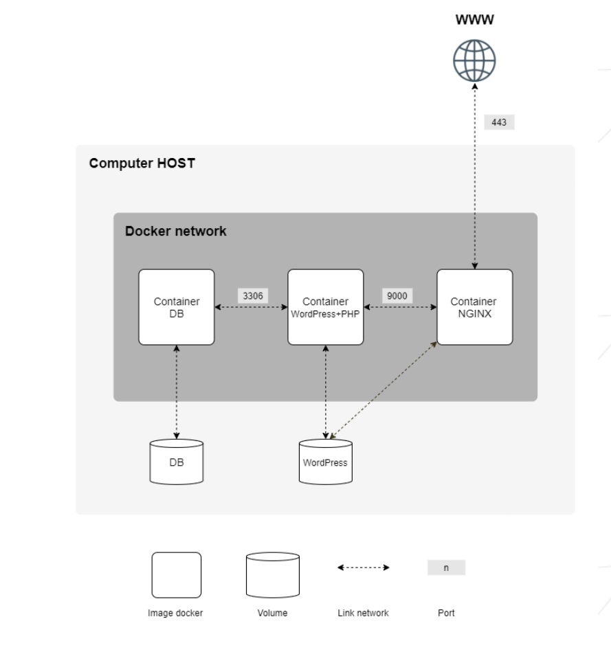

# Inception

## Overview

"Inception" is a project that uses Docker Compose to create a local development environment for a WordPress site. This environment includes Nginx and MariaDB, which are used as the web server and database server respectively.

Here's a breakdown of the components:

Docker Compose: This is a tool for defining and managing multi-container Docker applications. It uses a YAML file (usually named docker-compose.yml) to configure the application's services, networks, and volumes. With a single command, you can create and start all the services defined in the configuration.

WordPress: This is a popular open-source management system used to create websites and blogs. In this project, it's one of the services managed by Docker Compose.

Nginx: This is a high-performance HTTP server and reverse proxy. In this project, it's used to serve the WordPress site. Nginx is preferred over Apache for its performance and resource efficiency.

MariaDB: This is a community-developed fork of the MySQL relational database management system. It's used in this project to store the WordPress site's data.

The benefit of this setup is that it allows developers to work on WordPress projects locally without needing to install and configure a traditional LAMP (Linux, Apache, MySQL, PHP) stack on their machines. Instead, all the necessary services are containerized and managed by Docker, which can simplify setup, improve reproducibility, and avoid conflicts between different projects' dependencies.

## Prerequisites

- Docker
- Docker Compose

## Setup

1. Clone the repository:
```bash
git clone https://github.com/faboussard/docker.git
```
2. Navigate to the project directory:
```bash
cd inception
```
3. Run the application:
```bash
sudo make
```
4. Accessing the Application (In your web browser):
```bash
https://faboussa.42.fr
```
## Services

- **Nginx**: Acts as a reverse proxy for the WordPress application.
- **WordPress**: The main application.
- **MariaDB**: The database used by WordPress.

## Volumes

- `wordpress-data`: Persists WordPress data.
- `mariadb-data`: Persists MariaDB data.

## Networks

- `inception`: A custom network for the containers to communicate.




